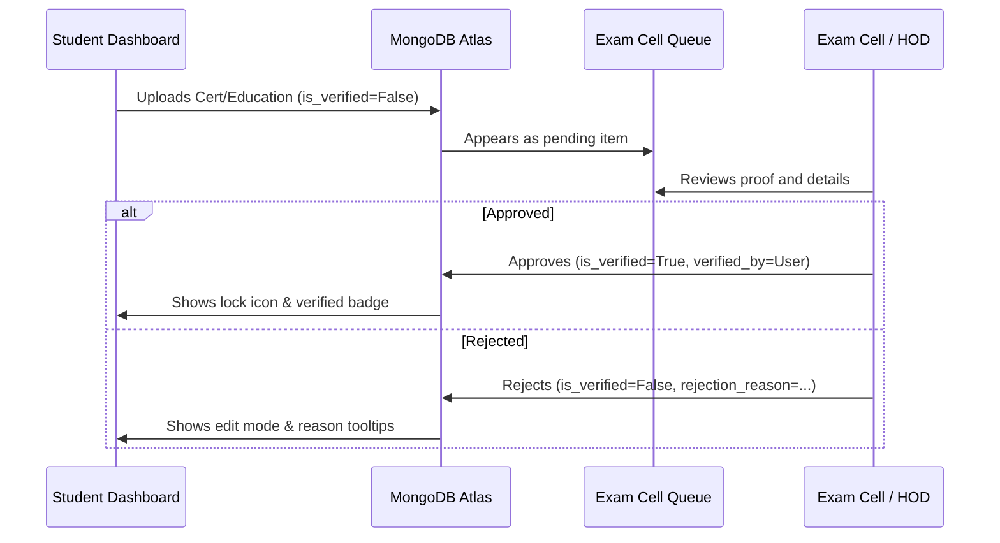

# College ERP — Comprehensive Dashboard & Architecture Documentation

This document provides a detailed, "pin-to-pin" breakdown of all dashboards, technology stacks, project structures, and core data flows within the College ERP web application.

---

## 1. Global Technology Stack

The College ERP web application is built with a decoupled architecture utilizing a modern Python backend, a flexible NoSQL database, and a responsive, high-performance vanilla frontend.

### Backend Stack
*   **Core Framework**: Django 5.x (using class-based views for clean encapsulation).
*   **Database Engine**: MongoDB Atlas (NoSQL) integrated via `django-mongodb-backend` (v5.2.3+) and `pymongo` (v4.6.0+), providing document-store scalability with Django's native ORM functionality.
*   **API Layer**: Django REST Framework (DRF v3.14.0+) with JWT authentication (`djangorestframework-simplejwt`) for decoupled mobile or external service integrations.
*   **Asynchronous Tasks & Queues**: Celery (v5.3.0+), Redis (v5.0.0+), `django-celery-beat`, and `django-celery-results` for async email dispatch, OTP expiration checks, and scheduled syncs.
*   **API Documentation**: `drf-spectacular` generating OpenAPI 3.0 schemas and Swagger UI/Redoc interfaces.
*   **Security & Error Monitoring**: Sentry SDK, `django-ratelimit` (for OTP and login endpoints), and structured JSON logging (`python-json-logger`).

### Frontend Stack
*   **Templating Engine**: Standard Django Templates engine with template inheritance and partials.
*   **Dynamic UX (No Page Reloads)**: `django-htmx` integrating **HTMX** (v1.9+) for AJAX-driven form submits, partial HTML replacements, and asynchronous loaders.
*   **Styling System**: Clean **Vanilla CSS3** featuring custom variable-driven themes (light/dark modes), flexible grids, CSS Flexbox layouts, and custom interactive transitions.
*   **Charts & Visualization**: `Chart.js` for department aggregates, cohort progress, and student grade profiles.
*   **Helper Libraries**: Vanilla JS and lightweight jQuery integrations for dynamic animations, sidebar toggles, and direct message widget updates.

---

## 2. Codebase Structure & Directory Map

The codebase is organized following clean architecture principles, separating user management, core configurations, and domain-specific portals into independent Django apps.

```
erp_portal-main/
├── manage.py                     # Django CLI command runner
├── requirements/                 # Dependency lists
│   ├── base.txt                  # Production requirements (Django, MongoDB backend, Celery)
│   └── development.txt           # Testing & linting utilities (pytest, black, flake8)
├── config/                       # Core project configurations
│   ├── settings/                 # Modular settings
│   │   ├── base.py               # Main configurations (installed apps, middleware, DB connections)
│   │   └── development.py        # Local overrides
│   ├── urls.py                   # Global routing definitions (UI portals, APIs, admin endpoints)
│   ├── celery.py                 # Celery worker configuration
│   └── mongodb_apps.py           # Custom Mongo backend configuration hooks
├── apps/                         # Modular Django applications
│   ├── core/                     # Common helpers, homeviews, global search, theme/role middlewares
│   ├── accounts/                 # User profiles, auth controllers, OTP tokens, RBAC setup commands
│   ├── academics/                # Core domain schemas (Departments, Sections, Subjects, Marks, Attendance)
│   ├── faculty/                  # Lesson plans, timetables, cohorts, training programs, syllabus coverage
│   ├── students/                 # Student profile, education logs, certs, projects, internships, portfolios
│   ├── parents/                  # Parent dashboard views and child academic summaries
│   ├── notifications/            # Multi-channel notification delivery system
│   ├── messaging/                # Direct messaging system (inbox api, messages model)
│   └── audit/                    # Immutable change tracking system (AuditLog engine)
├── static/                       # Global static assets
│   ├── css/                      # Application stylesheets (index.css, portal.css, site_theme.css)
│   └── js/                       # Interactive scripts (portal.js, messaging.js, site_theme.js)
└── templates/                    # Core template files
    ├── base.html                 # Shell layout containing navigation, notifications, messaging sidebar
    ├── student_portal/           # Student UI views (dashboard.html, portfolio_profile.html, certs.html)
    ├── faculty/                  # Faculty/HOD/Mentor layouts and sub-dashboards
    ├── parents/                  # Parents portal layout (dashboard.html)
    ├── messaging/                # Global messaging widget wrapper
    └── notifications/            # Announcement lists and publisher models
```

### Core Design Patterns
1.  **RBAC (Role-Based Access Control)**: Enforced via `RoleRequiredMixin` and custom user roles (`Director`, `Examcell`, `HOD`, `Mentor`, `Faculty`, `Student`, `Parent`). Configured automatically via the `python manage.py setup_roles` command.
2.  **Selectors & Services**: Data queries are contained within selectors (e.g., `apps.students.selectors`), while database writes, modifications, and logic updates are handled inside service modules (e.g., `apps.students.services`).
3.  **Audit Logs**: Writes to sensitive tables are backed up by the `apps.audit` engine, capturing the actor, target object, changes, timestamp, and IP address.
4.  **Theme & Redirection Middlewares**:
    *   `EnsureCsrfCookieMiddleware`: Guarantees CSRF tokens are injected for HTMX integration.
    *   `RoleMiddleware`: Automatically handles redirection based on user credentials.
    *   `SiteThemeMiddleware`: Sets user theme preference (light vs dark mode) dynamically across request-response boundaries.

---

## 3. Comprehensive Dashboard Specifications

Below is a pin-to-pin description of every dashboard available in the College ERP Portal.

---

### A. Student Portal Dashboard
*   **Target URL**: `/student/portal/`
*   **View Layer**: `StudentPortalView` (`apps/students/views.py`)
*   **Authentication & Access Control**: `LoginRequiredMixin`. Restricted strictly to users with the role `Student` who have a valid `StudentProfile`. Redirects other roles to the global landing page.

#### UI Features & Layout
*   **Completion Progress Bar**: A visual circular progress tracker displaying the profile completion percentage. Calculated based on 8 criteria: profile photo upload, resume upload, personal email verification, phone number entry, linked social profile, educational history, projects, and certifications.
*   **Activity Stream**: A unified chronological timeline feed showing the student's recent achievements (new projects, certifications, resume updates) with verification badges.
*   **Overview Stats Cards**: Quick summary counts showing total projects, certifications, internships, courses, research work, and active cohorts.
*   **Verified Items Counter**: Displays the sum of all credentials verified by the Exam Cell or HOD.
*   **Academics Quick Glance**: Renders internal and external marks for the current semester's subjects.

#### Backend Logic & Data Flow
*   **GET Handler**:
    1.  Validates user role and fetches the associated `StudentProfile` with pre-fetched related fields.
    2.  Compiles academics list: filters `Subject` records matching the student's `department` and maps internal/external scores from the `Marks` model.
    3.  Assembles activity feed: combines certifications, projects, and resume updates, sorting by the `created_at` timestamp.
    4.  Calculates profile completeness metric by evaluating attributes and counts.
    5.  Renders the output using `student_portal/dashboard.html`.

---

### B. Student Profile & Portfolio Customizer
*   **Target URL**: `/student/portal/profile/` (Edit) & `/student/portal/portfolio/` (Private Portfolio) & `/student/p/<slug>/` (Public Portfolio)
*   **View Layer**: `StudentProfileEditView`, `StudentPortfolioView`, `TogglePublicProfileView`, `StudentContactOtpView` (`apps/students/views.py`)
*   **Authentication & Access Control**: `LoginRequiredMixin` for editing and private view. Public portfolio is open to everyone if the profile's `is_public` attribute is set to `True`.

#### UI Features & Layout
*   **Profile Editing Pane**: Input forms to update full name, personal profile summary, and contact information. Includes drag-and-drop file upload fields for profile photo and resume.
*   **Portfolio Visibility Toggles**: Granular switches to control public exposure of contact details, resume download, and specific coding platform links (GitHub, LinkedIn, LeetCode, HackerRank, CodeChef, Codeforces).
*   **OTP Email Verification Widget**: Clicking "Send OTP" sends a 6-digit verification code to the personal email field, changing its badge from "Not Verified" (red) to "Verified" (green) upon entering the correct code.
*   **Responsive Portfolio Showcase**: A premium resume page layout featuring tabs for professional overview, academic history, projects, and certifications.

#### Backend Logic & Data Flow
*   **Profile Save (POST)**: Validates input lengths, handles file attachments, updates `StudentProfile` attributes, and updates the `User` model's name attribute.
*   **Visibility Control (POST)**: Toggles the boolean state of `is_public` on the student record. If true, the system exposes `/student/p/<slug>/` globally.
*   **OTP Dispatch & Validation (POST)**:
    1.  Generates a random 6-digit verification code.
    2.  Creates a database entry in `OTPRecord` with a 10-minute expiry window.
    3.  Calls the asynchronous task helper `send_otp_email` to dispatch the verification code.
    4.  Verification step: inspects `OTPRecord` for matching code, expiration status, and usage state, marking the email as verified upon success.

---

### C. Student Academics Portal
*   **Target URL**: `/student/portal/academics/`
*   **View Layer**: `StudentAcademicsView` (`apps/students/views.py`)
*   **Authentication & Access Control**: `LoginRequiredMixin` (restricted to Student role).

#### UI Features & Layout
*   **Semester Marks Grade Sheet**: Displays subjects grouped by semester.
*   **Dynamic Performance Grid**: Columns for subject name, subject code, semester, credit weight, internal score, external score, total points, and letter grade.

#### Backend Logic & Data Flow
*   **GET Handler**:
    1.  Queries the student's department `Subject` models.
    2.  Fetches `Marks` records associated with the student profile.
    3.  Maps each subject to its corresponding grade parameters, inserting placeholder dashes (`-`) if records have not yet been logged by faculty.
    4.  Renders the output using `student_portal/academics.html`.

---

### D. Student Portfolio Sub-Modules (Certifications, Projects, Internships, Research, Education)
*   **Target URLs**:
    *   Certifications: `/student/portal/certifications/`
    *   Projects: `/student/portal/projects/`
    *   Internships: `/student/portal/internships/`
    *   Research: `/student/portal/research/`
    *   Education: `/student/portal/education/`
*   **View Layer**: `StudentCertificationsView`, `StudentProjectsView`, `StudentInternshipsView`, `StudentResearchView`, `StudentEducationView` (`apps/students/views.py`)
*   **Authentication & Access Control**: `LoginRequiredMixin` (restricted to Student role).

#### UI Features & Layout
*   **Resource Manager Panels**: Dynamic CRUD interfaces. Students can add records, upload attachments, link portfolios, and edit fields.
*   **Verification Status Badges**: Displays status indicator badges next to each entry:
    *   `Pending`: Grey badge, record is editable and waiting for validation.
    *   `Verified`: Green badge, record is locked for security.
    *   `Rejected`: Red badge, hover displays feedback reason submitted by the Exam Cell.

#### Backend Logic & Data Flow
*   **POST Handler**:
    *   `Create Action`: Saves input fields to corresponding models (`Certification`, `Project`, `Internship`, `Research`, `EducationBackground`), setting `is_verified` to `False`.
    *   `Edit Action`: Allows updates only if the record's current state is not verified.
    *   `Delete Action`: Deletes the item from the database.
    *   *Credly Metadata Parser*: For certifications added via link, the backend runs a helper parser (`_extract_cert_metadata`) that pulls key attributes (issuer, title, issue date) to auto-fill input fields.

---

### E. HOD (Head of Department) Dashboard
*   **Target URL**: `/faculty-portal/hod/`
*   **View Layer**: `HODDashboardView` (`apps/faculty/views.py`)
*   **Authentication & Access Control**: `RoleRequiredMixin` (restricted strictly to HOD role).

#### UI Features & Layout
*   **Department Overview Analytics**:
    *   Department-wide syllabus completion rate chart (rendered via Chart.js).
    *   Assigned vs. Unassigned student mentor distribution pie chart.
    *   Average CGPA chart grouped by batch year.
*   **Faculty Assignment Panel**: Grid interface listing all department faculty, subjects assigned, and their teaching load status.
*   **Mentor Matching Tool**: Form to select a Mentor and assign multiple students to them for the current academic year.
*   **Academic Document Uploaders**: Dedicated drop zones for departmental Timetables, Lesson Plans, and Academic Calendars.
*   **Training & Announcements Workspace**: CRUD managers for department skill training courses and global portal announcements.

#### Backend Logic & Data Flow
*   **GET Handler**:
    1.  Resolves the HOD's active `Department`.
    2.  Queries faculty and mentors mapped to this department.
    3.  Pulls student mentor assignments for the current academic year.
    4.  Runs department aggregates: calculates average student CGPA, counts unassigned students, and aggregates syllabus completion percentages from `SyllabusCoverage`.
    5.  Renders the dashboard using `faculty/hod_dashboard.html`.
*   **POST Actions**:
    *   `assign_mentor_students`: Creates or updates a `StudentMentorAssignment` record.
    *   `upload_lesson_plan`: Stores uploaded document to `LessonPlan` model.
    *   `upload_timetable`: Stores timetable schedules linked to specific semesters.
    *   `upload_calendar`: Uploads PDF schedules to `AcademicCalendar`.
    *   `create_training`/`update_training`: Manages departmental training initiatives.
    *   `create_announcement`: Publishes announcements visible to all portal roles.

---

### F. Mentor Dashboard
*   **Target URL**: `/faculty-portal/mentor/`
*   **View Layer**: `MentorDashboardView` (`apps/faculty/views.py`)
*   **Authentication & Access Control**: `RoleRequiredMixin` (restricted strictly to Mentor role).

#### UI Features & Layout
*   **Mentee Performance Grid**: Displays the mentor's assigned students with stats: CGPA, academic average score, and overall attendance percentage.
*   **Scatter/Bar Performance Chart**: Chart.js integration displaying CGPA vs. Average Exam Score for all assigned students to identify academic outliers.
*   **Grade and Attendance Uploader**: Modal forms to input attendance logs and marks for students in the mentor's department.

#### Backend Logic & Data Flow
*   **GET Handler**:
    1.  Queries `StudentProfile` records where the current user is assigned as the mentor for the current academic year.
    2.  Iterates through mentees and calculates average mark parameters and attendance rates (`Attendance` present / total).
    3.  Fetches department courses and syllabus guidelines to display.
    4.  Renders the dashboard using `faculty/mentor_dashboard.html`.
*   **POST Actions**:
    *   `upload_marks`: Writes student score credentials to the `Marks` model.
    *   `upload_attendance`: Appends attendance state records for a given subject and date.

---

### G. Faculty Dashboard
*   **Target URL**: `/faculty-portal/portal/`
*   **View Layer**: `FacultyDashboardView` (`apps/faculty/views.py`)
*   **Authentication & Access Control**: `RoleRequiredMixin` (accessible by Faculty, Mentor, and HOD roles).

#### UI Features & Layout
*   **Syllabus Coverage Tracker**: Lists assigned subjects. Each subject card has an interactive unit tracker where teachers update total topics, covered topics, and upload notes.
*   **Performance Monitoring Graph**: Displays average scores for students taking the faculty's courses.
*   **Cohort Manager Workspace**: Interface to create student cohorts (academic or skill-based) across department students.
*   **Internal Course Builder**: Allows creating internal courses, publishing materials, and setting up assessments.

#### Backend Logic & Data Flow
*   **GET Handler**:
    1.  Resolves subjects assigned to the user.
    2.  Calculates unit-wise completion ratios from the `SyllabusCoverage` model.
    3.  Fetches active student cohorts created by the teacher.
    4.  Renders dashboard using `faculty/faculty_dashboard.html`.
*   **POST Actions**:
    *   `create_cohort`/`update_cohort`: Manages user groupings in the `Cohort` model.
    *   `create_course`/`update_course`: Creates internal courses in `InstitutionCourse` and links them to cohorts.
    *   `upload_material`: Appends course files to `CourseMaterial`.
    *   `add_assessment`: Creates course assessments.
    *   `update_syllabus`: Updates syllabus units in `SyllabusCoverage`.
    *   `update_marks`: Updates subject marks in `Marks`.

---

### H. Exam Cell Dashboard (Verification Queue)
*   **Target URL**: `/student/verification/queue/`
*   **View Layer**: `StudentVerificationQueueView`, `StudentManagementDetailView` (`apps/students/views.py`)
*   **Authentication & Access Control**: `LoginRequiredMixin` (restricted strictly to the `Examcell` role).

#### UI Features & Layout
*   **Unified Pending Roster**: A list categorized into tabs for pending Education records, Certifications, and Semester results.
*   **Document Viewer Modals**: Renders proof files and certificates directly in the browser for review.
*   **Decision Workspace**: Accept/Reject buttons with an input field for rejection remarks.

#### Backend Logic & Data Flow
*   **GET Handler**:
    1.  Queries unverified records from `EducationBackground`, `Certification`, and `SemesterResult`.
    2.  Renders the queue using `students/verification_queue.html`.
*   **POST Actions**:
    1.  Identifies the action type (education, cert, semester result) and target ID.
    2.  On `Approve`: Sets `is_verified` to `True` and logs `verified_by` to the current user.
    3.  On `Reject`: Leaves `is_verified` as `False`, stores the `rejection_reason`, and clears verification metadata.

---

### I. Parent Dashboard
*   **Target URL**: `/parent/portal/`
*   **View Layer**: `ParentDashboardView` (`apps/parents/views.py`)
*   **Authentication & Access Control**: `LoginRequiredMixin` (restricted to the `Parent` role, or students with `is_parent_login` set to `True` in their session).

#### UI Features & Layout
*   **Children Overview Cards**: Displays cards for all children registered under the parent profile.
*   **Academic Summary Sheets**: Shows the child's average exam performance and detailed subject grades.

#### Backend Logic & Data Flow
*   **GET Handler**:
    1.  Checks if the user has parent credentials or a student session toggle.
    2.  Resolves students linked to the parent.
    3.  Aggregates grade reports and average scores from the `Marks` model for each child.
    4.  Renders the dashboard using `parents/dashboard.html`.

---

### J. Direct Messaging & Notifications Widget
*   **Target URL**: `/messages/inbox/` (Inbox API) & `/notifications/` (List View)
*   **View Layer**: `inbox` & `send` in `apps.messaging.views`, `NotificationListView` in `apps.notifications.views`
*   **Authentication & Access Control**: `LoginRequiredMixin`.

#### UI Features & Layout
*   **Direct Message Slide-out**: A sidebar chat widget available on all dashboards.
*   **Chat Threads Interface**: Grouped by active users. Displays message history and replies.
*   **Allowed Recipient Dropdown**: Populates recipients based on the user's role:
    *   *Faculty/Mentors/HODs* can message any user.
    *   *Students* can only reply to incoming threads.
*   **Live Notification Center**: A header dropdown showing unread alerts, directing users to the full notifications list.

#### Backend Logic & Data Flow
*   **Messaging (AJAX)**:
    *   `GET /messages/inbox/`: Retrieves message logs involving the user and updates their status to read.
    *   `POST /messages/send/`: Validates recipient permissions, creates a `DirectMessage` object, and returns a JSON response.
*   **Notifications**:
    *   `GET /notifications/`: Displays alerts matching the user's role and department.
    *   `POST /notifications/create/`: Allows HODs and Directors to publish target-specific alerts.

---

### K. Admin / Director Dashboard
*   **Target URL**: `/admin/` & `/admin/bulk-upload/`
*   **View Layer**: Django Admin Interface, `bulk_upload_view` (`apps/accounts/bulk_upload.py`)
*   **Authentication & Access Control**: Superuser permission (automatically assigned to the `Director` role).

#### UI Features & Layout
*   **System Admin Panel**: High-level database administration options.
*   **Bulk CSV Upload Interface**: Dedicated file upload portal to bulk register students, faculty, and other staff members.

#### Backend Logic & Data Flow
*   **CSV Import Process**:
    1.  Parses uploaded CSV files using `openpyxl`/`csv`.
    2.  Validates required columns: email, full name, role, department, section, roll number, and batch.
    3.  Runs a transaction to create `User` records, generate initial passwords, set roles, and initialize corresponding profile tables.

---

## 4. Summary of Data Flows & Workflows

Here is a summary of how different components in the College ERP system interact:

### 1. Student Verification Workflow


### 2. Messaging Authorization Matrix
| Sender Role | Recipient Role | Permitted? | Workflow Logic |
| :--- | :--- | :---: | :--- |
| **Faculty / Mentor / HOD** | Any User | **Yes** | Full composition allowed via the chat widget. |
| **Student** | Faculty / Mentor | **Reply Only** | Can only send messages in existing threads initiated by staff. |
| **Student** | Another Student | **No** | Restrictive security check prevents message generation. |
| **Parent** | Any User | **No** | Read-only access to child data (no messaging permissions). |

### 3. Grading & Syllabus Progress Flow
1.  **Faculty** sets up subject units in the Syllabus Tracker.
2.  **Faculty** logs unit progress, which updates the department progress gauge on the **HOD Dashboard**.
3.  **Faculty / Mentor** uploads semester scores via CSV or portal form.
4.  **Student / Parent** gets real-time access to grades and average updates on their dashboard.
